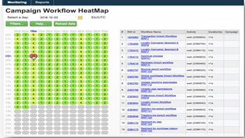
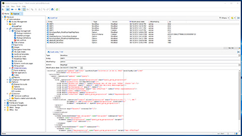
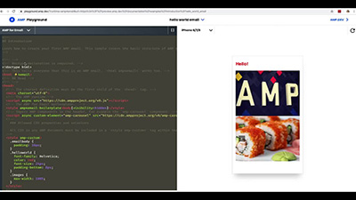

# Tutoriales de Adobe Campaign Classic V7: información general

Adobe Campaign ofrece una plataforma para diseñar experiencias en canales múltiples para los clientes y proporciona un entorno para la orquestación visual de la campaña, la administración de interacciones en tiempo real y la ejecución en canales múltiples. Esta guía del usuario contiene vídeos y tutoriales sobre las numerosas funciones y funcionalidades de Adobe Campaign Classic V7.

>[!INFO]
> ¿Tiene preguntas? ¿Le gustaría compartir su experiencia o intercambiar ideas con sus colegas? O bien, ¿tiene comentarios sobre el contenido de aprendizaje para el equipo de Adobe? Únase a la conversación en el [hilo de la comunidad de aprendizaje de Adobe Campaign](https://experienceleaguecommunities.adobe.com:443/t5/adobe-campaign-classic/join-the-discussion-on-adobe-campaign-learning/td-p/419096?profile.language=es).

## Novedades

* **[Panel de control de Campaign para modelos de alojamiento híbridos](https://experienceleague.adobe.com/docs/control-panel-learn/control-panel/control-panel-for-hybrid-hosting-models.html)**

   *Obtenga información sobre cómo habilitar el Panel de control de Campaign para los modelos de alojamiento híbridos de Adobe Campaign, acceder al Panel de control de Campaign y desbloquear funciones clave.*

* **[Panel de control de Campaign: Monitorización de flujos de trabajo](https://experienceleague.adobe.com/docs/control-panel-learn/control-panel/performance-monitoring/monitor-workflows.html){target=&quot;_blank&quot;}**

   *Obtenga información sobre cómo monitorizar el uso temporal del almacenamiento de sus flujos de trabajo y dónde configurar la configuración del flujo de trabajo para evitar problemas de la base de datos o del flujo de trabajo en su instancia.*

* **[Panel de control de Campaign: entradas de monitor y latencia](https://experienceleague.adobe.com/docs/control-panel-learn/control-panel/performance-monitoring/monitor-throughputs-and-latency.html){target=&quot;_blank&quot;}**

   *Obtenga información sobre cómo monitorizar las entradas de envíos y las latencias de mensajes transaccionales de la instancia de campaign.*

* **[Introducción a los SMS](https://experienceleague.adobe.com/docs/campaign-learn/set-up-sms-for-adobe-campaign/introduction-to-sms.html?lang=es)**

   *Descubra cómo funcionan los SMS y cómo envía SMS Adobe Campaign*

* **[Configuración de una cuenta de SMS para un proveedor SMPP estándar](https://experienceleague.adobe.com/docs/campaign-learn/set-up-sms-for-adobe-campaign/set-up-account-for-standard-smpp-provider.html?lang=es)**

   *Aprenda a adaptar el conector SMS a su proveedor SMPP. Ajuste la configuración de SMS para gestionar los límites de conexión, configure el rendimiento máximo, la ventana de envío y el cifrado con TLS.*

## Nuestra selección

<table>
<tr>
  <td>
    
    

      <a href="./monitoring-campaign-classic/workflow-heatmap.md">
    <strong>Mapas térmicos del flujo de trabajo</strong>
    </a>
    

    

    <em>Obtenga información general sobre el número de flujos de trabajo simultáneos.</em>
    

  </td>
   <td>
    
    

      <a href="./monitoring-campaign-classic/audit-trail.md">
    <strong>Pista de auditoría</strong>
    </a>
    
 
    

    <em>Captura una lista completa de las acciones y eventos que se producen dentro de Adobe Campaign.</em>
    

  </td>
  <td>
    
    

      <a href="./sending-messages/email-channel/defining-interactive-email-content-with-amp.md">
    <strong>Definición del contenido de correo electrónico interactivo con AMP</strong>
    </a>
    

    

    <em>Obtenga información sobre cómo activar y utilizar AMP en Adobe Campaign Classic </em>
    

  </td>
</tr>
</table>

## Recursos adicionales

* [Documentación](https://experienceleague.adobe.com/docs/campaign-classic/using/getting-started/starting-with-adobe-campaign/about-adobe-campaign-classic.html?lang=es)
